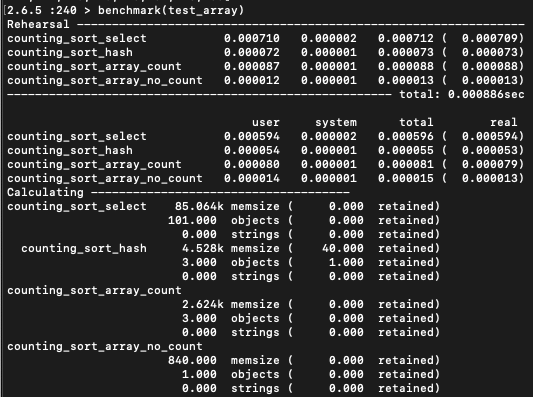

# understandingBigO

Repo to test different coding challenges and benchmark them to understand Time and Space complexity

# Counting Sort 1 - Solutions benchmark

## Chanllenge:

Counting Sort 1
We will start with an easy task - counting.

Given a list of integers, can you count and return the number of times each value appears?
There is no need to sort the data, you just need to count it.

Input

The Input will be an array of numbers.

Output:

Output the number of times every number from 0 to 99 (inclusive) appears in the list.

## For this case we evaluate 3 different solutions

### counting_sort_select

This solution uses the ``select` method as the key component to find the repeated element's count.

```
def counting_sort_select(array)
  result = []
   for element in (0..99)
    filtered_array = array.select{|number| number == element} #[1,1]
    result.push(filtered_array.length) # result[0] = 2
   end
   return result
end
```



### counting_sort_hash

```
def counting_sort_hash(array)
  myhash = Hash.new(0)
  result = []

  for index in (0...array.length)
    next if !array[index]
    value = array[index]
    if myhash[value]
      myhash[value] = myhash[value] + 1
    else
      myhash[index] = 1
    end
  end
  for i in (0..99)
    if myhash[i]
      result << myhash[i]
    else
      result << 0
    end
  end
  return result
end
```

### counting_sort_array_count

```
def counting_sort_array_count(array)

  count_array = Array.new(100,0)

  (array & (0..99).to_a).each do |number|
    count_array[number] = array.count(number)
  end
  return count_array

end
```

### counting_sort_array_count

```
def counting_sort_array_no_count(array)

  count_array = Array.new(100,0)

  array.each do |number|
    count_array[number] += 1
  end
  return count_array

end
```
